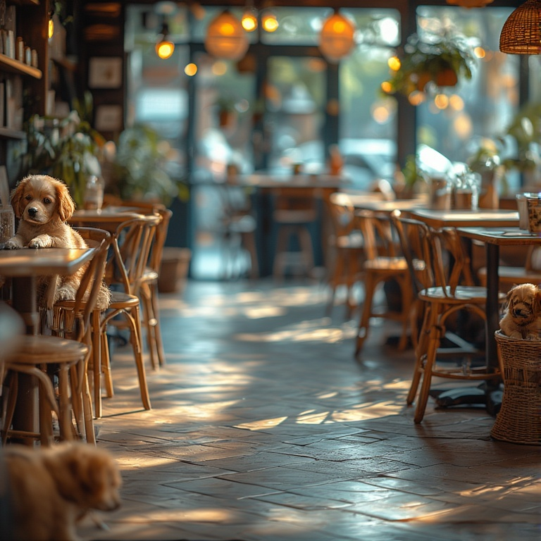

# Project Description
Welcome to CozyCup café! Here you can find delicious foods and tasty drinks to satiate your cravings. We are commited to serve you the best possible quality of beverages with snacks to come along with it. We can assure you, our beloved customers, that we serve with love and passion~
___
# Features
#### Make sure to try our adorable and delicious menu:
* ✅Coffees  
* ✅Cold Drinks  
* ✅Pastries  
* ✅Snacks  
___
# Screen Captures
  
#### *Our coffees and drinks are animal-themed and they will definitely give you those warm and fuzzy feelings~* ☕

#### *Delightfully crafted and almost too cute to eat, these animal-themed pastries are the perfect whimsical treat to brighten any day!* 🥐

  
#### *For a playful and delicious bite that's sure to bring a smile, these animal-themed snacks are an absolute must-have!* 🍪

  
#### *Escape the ordinary at our cozy, animal-themed cafe, where the warm, inviting atmosphere is filled with charming decor and delicious treats. Every corner is a delightful discovery, from the paw print coasters to the cat-shaped pastries. It's the perfect spot to relax, sip a latte, and enjoy a break from the everyday hustle~* 🐶😺
___
# About the authors

**Name:** Juan Miguel M. Malate  
**Email:** [202380200@psu.palawan.edu.ph](202380200@psu.palawan.edu.ph)

  

**Name:** Kenneth Vincent B. Castillo  
**Email:** [202380191@psu.palawan.edu.ph](202380191@psu.palawan.edu.ph)

  

